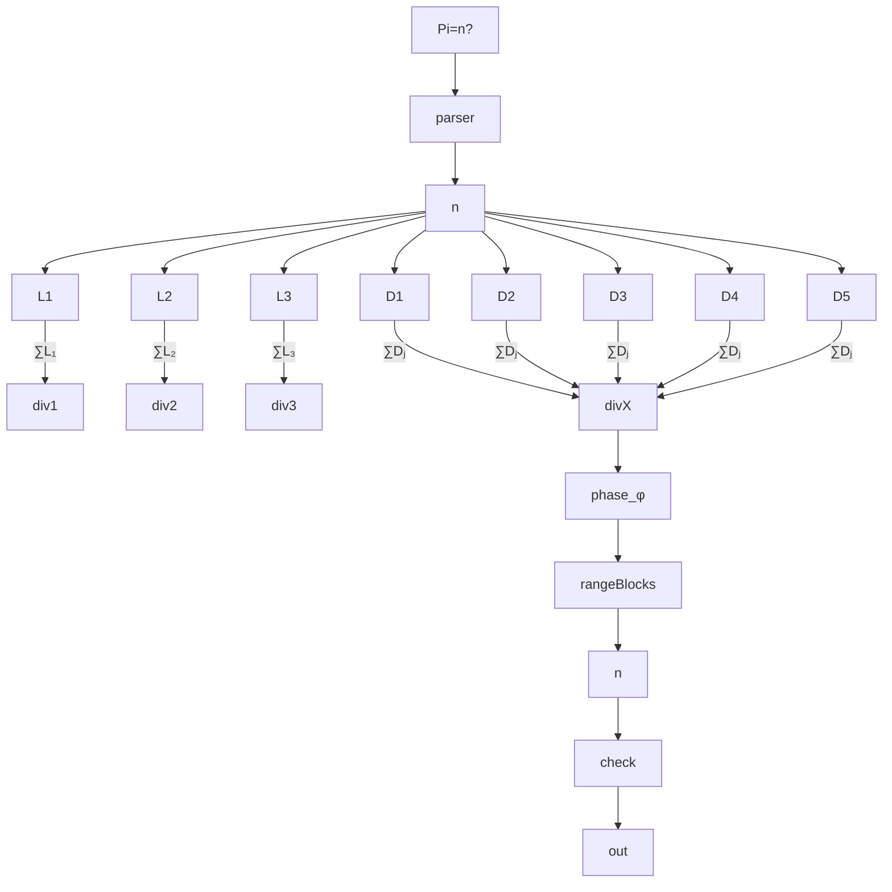

---

# 🚀 Дорожная карта реализации SIGPI — Сигнального Вычислителя Числа π

---

## 📘 Общая цель

Создать **фазово-сигнальный реактивный вычислитель**, в котором число π извлекается поразрядно через отношение длины окружности к диаметру без использования переменных, циклов, арифметики или памяти — строго по принципу СТБ:
**Signal → Block → Reaction → Signal**

---

## 📐 Архитектурные уровни

### 🧱 Уровень 1: Ввод сигнала

| Компонент        | Назначение                           |
| ---------------- | ------------------------------------ |
| `ParserBlock`    | Получает команду вида `Pi=n`         |
| `DigitChain`     | Извлекает из `n` отдельные `digit_k` |
| `DigitSignal[n]` | Передаёт сигнал в сигнальный словарь |
| ⚙ Связь          | 🔵 Ассоциативная                     |

---

### 🧱 Уровень 2: Возбуждение окружности (L)

| Компонент        | Назначение                                 |
| ---------------- | ------------------------------------------ |
| `L₁`, `L₂`, `L₃` | 3 цепочки по 360 блоков (длина окружности) |
| `LBlock[i][j]`   | Каждый блок добавляет массу фазы           |
| ⚙ Связь          | 🔴 Энергетическая                          |
| Выход:           | `Signal{Structure: L, Phase: ∑L[i]}`       |

---

### 🧱 Уровень 3: Возбуждение диаметра (D)

| Компонент                    | Назначение                                    |
| ---------------------------- | --------------------------------------------- |
| `D₁`, `D₂`, `D₃`, `D₄`, `D₅` | 5 цепочек по \~180 блоков                     |
| `DBlock[i][j]`               | Каждый блок добавляет фазу по своей плотности |
| ⚙ Связь                      | 🔴 Энергетическая                             |
| Выход:                       | `Signal{Structure: D, Phase: ∑D[i]}`          |

---

### 🧱 Уровень 4: Деление (L/D)

| Компонент            | Назначение                           |
| -------------------- | ------------------------------------ |
| `DividerBlock[i][j]` | Делает фазовое деление: φ = Lᵢ / Dⱼ  |
| Всего блоков         | 3L × 5D = 15 делителей               |
| ⚙ Связь              | 🟢 Резонансная                       |
| Выход:               | `Signal{Structure: φ, Phase: Lᵢ/Dⱼ}` |

---

### 🧱 Уровень 5: Диапазон фаз (φ ∈ range)

| Компонент       | Назначение                                           |
| --------------- | ---------------------------------------------------- |
| `RangeBlock[k]` | Проверяет попадание φ в диапазон \[0.1×k, 0.1×(k+1)] |
| k = 0..9        | Соответствует DigitBlock\[0..9]                      |
| ⚙ Связь         | 🔵 Ассоциативная                                     |
| Выход:          | `Signal{Structure: "digit_k", Phase: 1}`             |

---

### 🧱 Уровень 6: DigitBlock + Out

| Компонент         | Назначение                            |
| ----------------- | ------------------------------------- |
| `DigitBlock[k]`   | Активируется, если φ ∈ его диапазоне  |
| `DigitCheckBlock` | Сравнивает: активна ли нужная цифра n |
| `PiOutBlock`      | Если да → выводит Pi\[n] = k          |
| ⚙ Связь           | 🟡 Волевая / 🔵 Ассоциативная         |

---

## ⚙️ Поток работы системы

---

## 🧠 Принципы СТБ в реализации

| Принцип                | Реализация в SIGPI                       |
| ---------------------- | ---------------------------------------- |
| ❌ Нет циклов           | Всё построено на реакциях                |
| ❌ Нет переменных       | Только структура сигнала + фаза          |
| ✅ Память через фантомы | Фантомные возбуждения запоминают путь    |
| ✅ Ассоциации           | DigitBlock возбуждаются при совпадении φ |
| ✅ Разветвление фаз     | Параллельные деления Lᵢ / Dⱼ             |

---

## 📦 Типы связей на схеме

| Цвет линии    | Тип соединения | Функция                        |
| ------------- | -------------- | ------------------------------ |
| 🔴 Красный    | Энергия        | Масса сигнала, прямая передача |
| 🟣 Фиолетовый | Фантом         | Воздействие без возбуждения    |
| 🟢 Зелёный    | Резонанс       | Усиление фазового колебания    |
| 🔵 Синий      | Ассоциация     | Связь между фазой и цифрой     |
| 🟡 Жёлтый     | Волевой сигнал | Целевая проверка запроса Pi=n  |

---

## 🔜 Следующие шаги

1. Реализовать код-движок с реакцией на сигнал `"Pi=n"`
2. Построить цепочки L и D как массивы сигнальных блоков
3. Реализовать деление через фазу L/D
4. Проверить возбуждение диапазона `DigitBlock[n]`
5. Сравнение сигнала `n?` с результатом `digit_k`
6. Подключить CLI- или Web-интерфейс
7. Провести тесты на позициях `π[0..1000]`

---

